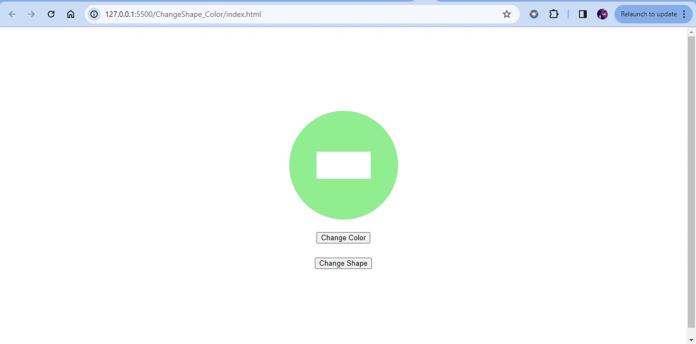
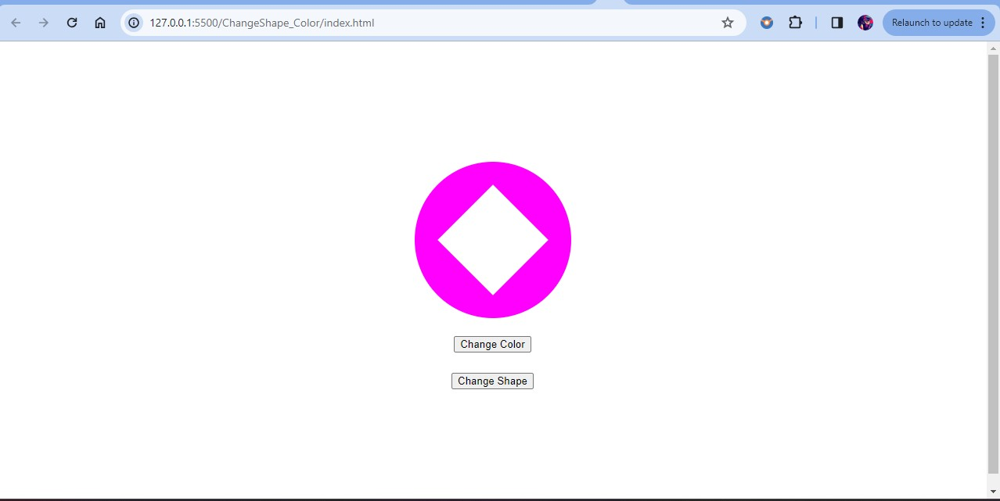
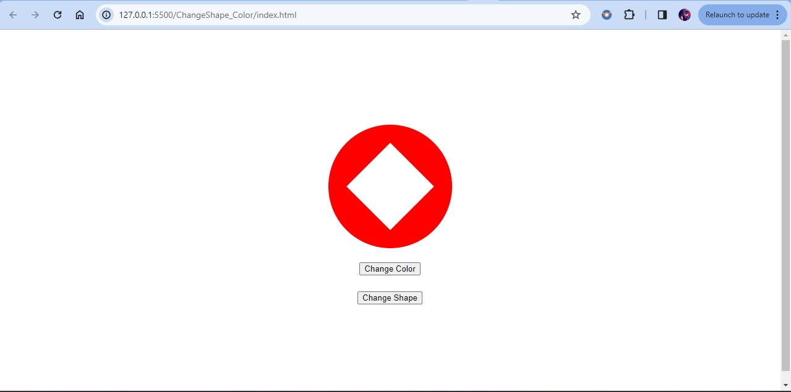

# Shape and Color Changer 

## [Hosted Link!](https://hsc92180.github.io/JS-Projects/ChangeShapeColor/)

This project is a simple web application that allows users to dynamically change the shape and color of a shape displayed on a web page. Below, we'll explain the code, its functionality, and how to run it.
Overview
## The project consists of three main components: HTML, CSS, and JavaScript. The HTML defines the structure of the web page, the CSS styles it, and the JavaScript adds interactivity by allowing users to change the shape and color of the displayed shape.
### HTML Structure
The HTML file, index.html, defines the structure of the web page. It contains a container, a shape element, and two buttons for changing the shape and color.
### CSS Styling
The CSS file, style.css, provides styles for the web page. It ensures the page is centered, sets the initial appearance of the shape (a blue circle with some margin), and styles the buttons.
### JavaScript Functionality
The script.js file adds functionality to the project. Here's how it works:
### Arrays: The code defines two arrays, colors and shapes, which store different colors and shape names.
Random Color and Shape Functions: Two functions, getRandomColor and getRandomShape, are defined. They select a random color or shape from the respective arrays.
. Event Listeners: The code sets up event listeners for the "Change Color" and "Change Shape" buttons. When clicked, these buttons trigger actions to change the shape's color and appearance.
. Change Color: Clicking the "Change Color" button changes the shape's background color to a randomly selected color from the colors array.
. Change Shape: Clicking the "Change Shape" button changes the shape's appearance based on the randomly selected shape from the shapes array. It modifies the shape's CSS properties like borderRadius, border, width, height, and transform to create various shapes.
. Initial Shape and Color: Upon loading the page, the code simulates a click on both the "Change Color" and "Change Shape" buttons to set an initial color and shape for the displayed element.

### Getting Started
To run this project on your local machine:
Clone the project repository to your computer.
Open the project folder in a code editor.
Launch the index.html file in a web browser.
You should now see a web page with a shape that can be dynamically modified using the provided buttons.
Customization
### You can customize this project by:
• Adding more colors and shapes to the colors and shapes arrays in the JavaScript file.
• Modifying the CSS styles in the style.css file to change the initial appearance of the shape or buttons.

### Acknowledgments
This project serves as a simple example of how HTML, CSS, and JavaScript can be combined to create interactive and dynamic web pages. Feel free to use, modify, and learn from it to create your own projects.
