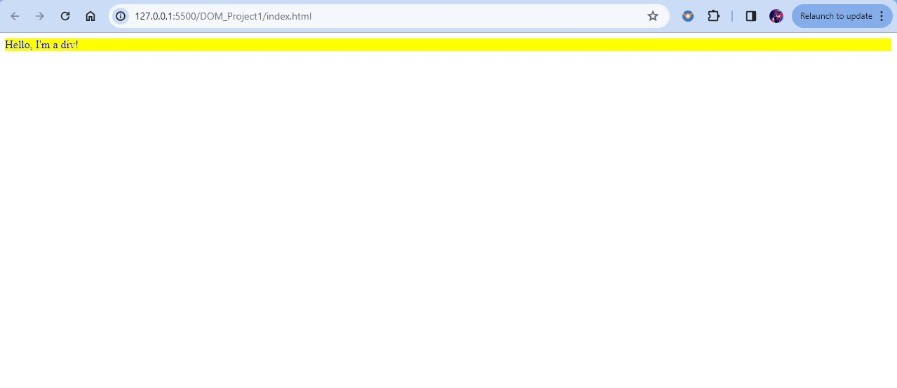

# DOM-Project 1

## [Hosted Link!](https://hsc92180.github.io/JS-Projects/DOM_Project1/)

### HTML Code:

### Javascript Code:

#### Explanation:

1. getElementById method to retrieve the target div element:

2. change text color: 

3. change background color:

4. set margin to style:

5. set padding:

6. set font size:

7. set font weight:

8. change height:

9. change width:
