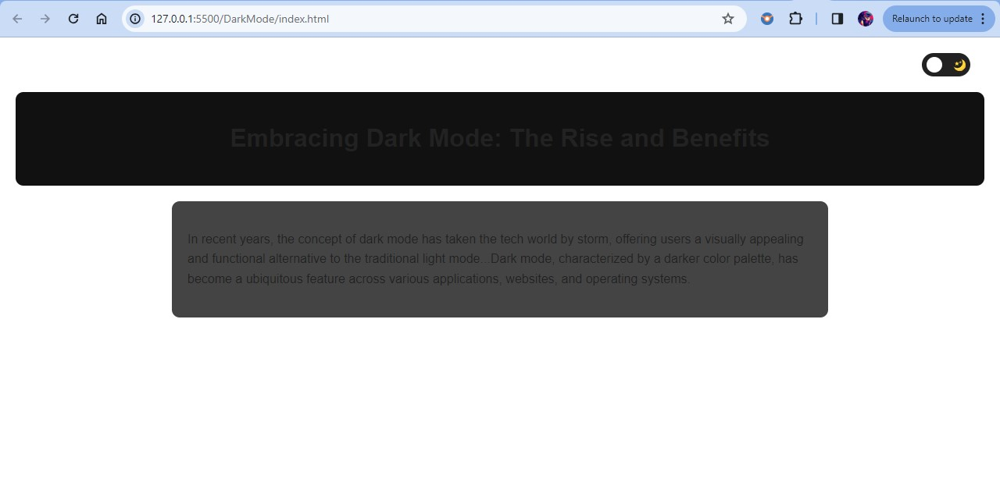
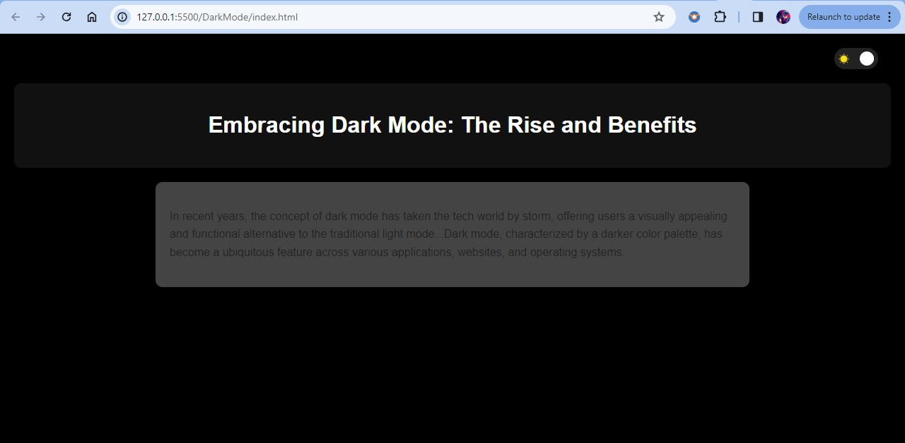

# Dark Mode

## [Hosted Link!](https://hsc92180.github.io/JS-Projects/DarkMode/)

This project is a simple web application that allows users to dynamically change the theme of the window to dark mode on a web page. Below, we'll explain the code, its functionality, and how to run it.
Overview
## The project consists of three main components: HTML, CSS, and JavaScript. The HTML defines the structure of the web page, the CSS styles it, and the JavaScript adds interactivity by allowing users to change the shape and color of the displayed shape.
### HTML Structure
The HTML file, index.html, defines the structure of the web page. It contains toggle container and some text.
### CSS Styling
The CSS file, style.css, provides styles for the web page. It ensures the page is centered and styles the toggle Container.
### JavaScript Functionality
The script.js file adds functionality to the project. Here's how it works:

Firstly, we fetch all the required element to the variables using getElementById() method and set one varriable toggled to false. Initially user can see Light Theme. Add a "click" event listener on toggle-container. If toggled is true then webpage change the background color to dark, change text color to white. When toggled is false then revert back these changes. I added styling for both the scenarios. Can add new styling by classList.add() method and remove it by classList.remove() method.

### Getting Started
To run this project on your local machine:
Clone the project repository to your computer.
Open the project folder in a code editor.
Launch the index.html file in a web browser.
You should now see a web page with a dark mode toggle that can be dynamically modify webpage theme to dark mode using toggle button given.